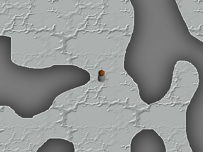

TopDownDungeonGame
==================

The code in this repository partially implements a real-time dungeon-crawler game in TypeScript using the This Could Be Better Game Framework.

Building
--------

To build the game, make sure the "tsc" command is installed, then run it from within the Source directory.

Running
-------

To run the game, open the .html file in the Source directory in a web browser that runs JavaScript.

Screenshots
-----------

